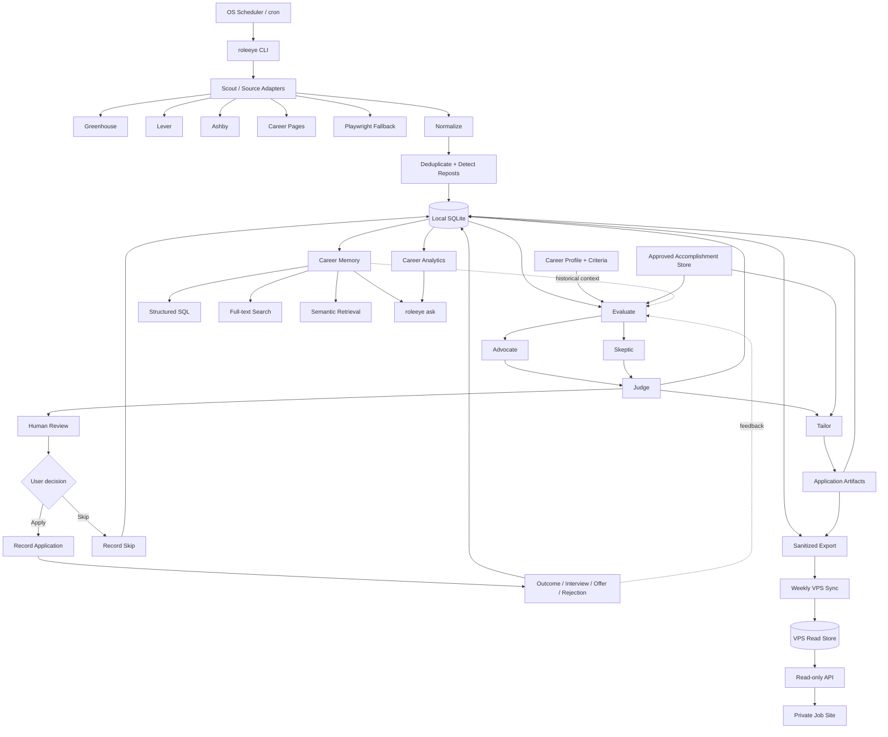
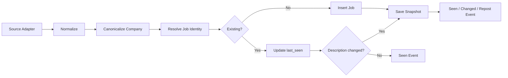
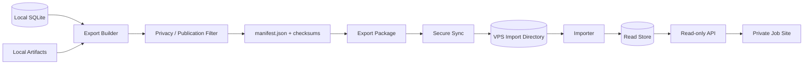

# RoleEye Architecture

> **RoleEye** — a local-first AI career agent that keeps an eye on the job market, while keeping the human in the loop.

## 1. Overview

RoleEye is a **local-first job discovery, career decision, application-memory, and analytics system**.

The architecture intentionally separates:

1. deterministic acquisition and persistence
2. LLM-based judgment
3. artifact generation
4. application history
5. structured + semantic retrieval
6. analytics
7. optional VPS replication / serving

The local SQLite database is the source of truth.

The system should begin as a CLI application and grow incrementally.

---

## 2. Architecture Goals

### Functional goals

- scan selected job sources daily
- normalize postings from different ATS providers
- retain every discovered posting
- detect duplicates and reposts
- score roles against configurable preferences
- explain fit and risks
- create tailored resume variants without inventing facts
- save application answers and artifacts
- track application status over time
- search historical jobs and applications
- provide local RAG after sufficient history exists
- calculate job-search funnel analytics
- export/sync sanitized datasets to a VPS
- expose a read-only API later for a private job-site dashboard

### Non-goals for v1

- auto-submitting applications
- browser-driving LinkedIn/Indeed as the primary discovery mechanism
- distributed microservices
- cloud-first storage
- multi-user SaaS
- automated recruiter outreach
- complex web UI
- autonomous edits to the user's master resume facts

---

## 3. High-Level System

RoleEye is organized around a continuous, human-approved learning loop:

```text
ROLEEYE

Scout → Evaluate → Human Review → Apply → Outcome
  ↑                                      │
  └──────────── Career Memory ───────────┘
```

The implementation underneath that product loop is:



---

# 4. Recommended Technology

## Runtime

- Node.js 22+
- TypeScript
- strict mode

## Local persistence

- SQLite
- migrations checked into the repository
- WAL mode when appropriate
- FTS5 for full-text search

## Configuration

- YAML for human-edited preferences/sources
- environment variables for secrets

## Validation

- Zod (or equivalent)

## HTTP

- native `fetch`
- provider-specific adapters

## HTML parsing

- lightweight DOM/parser library when required

## Browser fallback

- Playwright

Use browser automation only when deterministic HTTP/structured feeds are insufficient.

## CLI

Use a stable TypeScript CLI framework or a small explicit command router.

The CLI must support scripting and meaningful exit codes.

## LLM boundary

Create an interface rather than coupling core logic to one model/runtime.

Example:

```ts
interface ReasoningProvider {
  evaluateJob(input: JobEvaluationInput): Promise<JobEvaluationResult>;
  tailorResume(input: ResumeTailoringInput): Promise<ResumeTailoringResult>;
  answerCareerQuery(input: CareerQueryInput): Promise<CareerAnswer>;
}
```

Copilot CLI may be used during development and may optionally be used as one runtime provider through non-interactive invocation, but core storage, scanning, deduplication, and analytics must not depend on an interactive Copilot session.

---

# 5. Copilot CLI Integration

GitHub Copilot CLI should primarily serve two purposes:

## Development agent

Use Copilot CLI to implement the repository from `agent.md` + `architecture.md`.

## Optional reasoning runner

A provider may invoke Copilot CLI programmatically for bounded reasoning tasks.

Example conceptual boundary:

```text
roleeye evaluate <job-id>
        │
        ▼
create evaluation-input.json
        │
        ▼
CopilotReasoningProvider
        │
        ▼
copilot non-interactive prompt
        │
        ▼
validated evaluation-output.json
```

All returned output must pass schema validation before being persisted.

Do not depend on free-form prose when the caller expects structured data.

---

# 6. Scheduling

Long-running daily behavior should use the operating system scheduler.

Examples:

- cron on Linux/macOS
- Task Scheduler on Windows

Recommended daily job:

```text
roleeye scan
roleeye recommend --notify
```

Recommended weekly job:

```text
roleeye export --private
roleeye sync
```

Scheduling should call deterministic RoleEye commands.

The application should not require an interactive Copilot CLI session to stay open.

---

# 7. Repository Layout

```text
roleeye/
├─ agent.md
├─ architecture.md
├─ README.md
├─ package.json
├─ tsconfig.json
├─ .env.example
├─ .gitignore
│
├─ config/
│  ├─ criteria.example.yaml
│  ├─ sources.example.yaml
│  └─ sync.example.yaml
│
├─ profile/
│  ├─ career-profile.example.md
│  ├─ accomplishments.example.yaml
│  └─ master-resume.example.md
│
├─ src/
│  ├─ index.ts
│  │
│  ├─ cli/
│  │  ├─ scan.ts
│  │  ├─ show.ts
│  │  ├─ evaluate.ts
│  │  ├─ recommend.ts
│  │  ├─ resume.ts
│  │  ├─ application.ts
│  │  ├─ ask.ts
│  │  ├─ stats.ts
│  │  ├─ export.ts
│  │  ├─ sync.ts
│  │  └─ doctor.ts
│  │
│  ├─ config/
│  ├─ db/
│  │  ├─ database.ts
│  │  ├─ migrations/
│  │  └─ repositories/
│  │
│  ├─ discovery/
│  │  ├─ source-adapter.ts
│  │  ├─ greenhouse.ts
│  │  ├─ lever.ts
│  │  ├─ ashby.ts
│  │  └─ generic-career-page.ts
│  │
│  ├─ normalize/
│  ├─ evaluate/
│  │  ├─ advocate.ts
│  │  ├─ skeptic.ts
│  │  ├─ judge.ts
│  │  ├─ hard-filters.ts
│  │  └─ scoring.ts
│  │
│  ├─ reasoning/
│  │  ├─ provider.ts
│  │  └─ copilot-provider.ts
│  │
│  ├─ resume/
│  │  ├─ fact-store.ts
│  │  ├─ matcher.ts
│  │  ├─ tailor.ts
│  │  └─ validate-claims.ts
│  │
│  ├─ notifications/
│  ├─ applications/
│  ├─ search/
│  │  ├─ structured.ts
│  │  ├─ fulltext.ts
│  │  ├─ semantic.ts
│  │  ├─ planner.ts
│  │  └─ answer.ts
│  │
│  ├─ analytics/
│  ├─ export/
│  └─ sync/
│
├─ data/
│  └─ .gitkeep
│
├─ artifacts/
│  └─ .gitkeep
│
└─ tests/
   ├─ fixtures/
   ├─ unit/
   └─ integration/
```

---

# 8. Core Domain Model

## Job

Represents a logical opportunity.

Important fields:

```text
id
company_id
title
level
employment_type
work_arrangement
location_text
country
salary_min
salary_max
salary_currency
salary_period
source_type
source_job_id
source_url
canonical_url
description_text
description_hash
first_seen_at
last_seen_at
closed_at
created_at
updated_at
```

## JobSnapshot

Keep historical source snapshots.

```text
id
job_id
captured_at
source_url
raw_payload
raw_html_path
normalized_description
description_hash
```

Do not overwrite the only copy of a posting.

## JobSeenEvent

```text
id
job_id
seen_at
source_type
source_job_id
url
event_type  # discovered | seen_again | changed | reposted | closed
```

## Company

```text
id
name
normalized_name
domain
careers_url
notes
created_at
```

## Evaluation

Evaluations are versioned.

```text
id
job_id
profile_version
criteria_version
created_at

decision
score
confidence
headline

advocate_json
skeptic_json
judge_json

career_direction_fit
career_direction_reason
```

## Application

```text
id
job_id
created_at
applied_at
current_status
resume_artifact_id
application_url
referral
source
notes
```

## ApplicationStatusEvent

```text
id
application_id
from_status
to_status
occurred_at
notes
```

## Artifact

```text
id
job_id
application_id
type
path
checksum
created_at
metadata_json
```

Artifact types:

```text
resume
resume_diff
cover_letter
application_answers
interview_notes
recruiter_message
analysis
```

## Note

```text
id
job_id
application_id
company_id
created_at
kind
text
private
```

---

# 9. SQLite Schema Strategy

Use normalized relational tables for facts and JSON columns for provider-specific payloads / LLM structured details.

Recommended indexes:

- jobs(company_id, title)
- jobs(first_seen_at)
- jobs(last_seen_at)
- jobs(source_type, source_job_id)
- applications(applied_at)
- applications(current_status)
- evaluation(job_id, created_at)
- events(job_id, occurred_at)

Use unique constraints where identity is reliable.

Use migrations from the start.

---

# 10. Source Adapter Contract

```ts
interface JobSourceAdapter {
  readonly name: string;

  scan(config: SourceConfig): Promise<DiscoveredJob[]>;
}
```

A `DiscoveredJob` is raw-ish source data but must contain enough identity information to normalize.

```ts
type DiscoveredJob = {
  sourceType: string;
  sourceJobId?: string;
  companyName: string;
  title: string;
  location?: string;
  url: string;
  applyUrl?: string;
  description?: string;
  salary?: RawSalary;
  rawPayload?: unknown;
};
```

Adapters do not score jobs.

Adapters do not write directly to the database.

Adapters return data to the ingestion pipeline.

---

# 11. Ingestion Pipeline



All ingestion should be idempotent.

Running `roleeye scan` twice against the same source should not create duplicate logical jobs.

---

# 12. Deduplication and Repost Detection

## Identity hierarchy

Use in order:

1. stable source job ID
2. canonical apply URL
3. company + normalized title + location + strong description fingerprint
4. fuzzy candidate match requiring explicit confidence threshold

Never merge two jobs only because titles are similar.

## Repost

A repost is the same logical role appearing again after:

- source ID changes
- posting disappears and returns
- first/last seen gap exceeds configurable threshold
- content changes only modestly

Store a repost event rather than losing earlier timing.

---

# 13. Criteria Configuration

Example:

```yaml
profile_name: default

decision_thresholds:
  apply: 78
  maybe: 62

weights:
  career_direction: 20
  hands_on: 15
  product_customer: 15
  ai_relevance: 15
  technical_domain: 15
  location: 10
  compensation: 10

hard_filters:
  countries:
    - US

  relocation:
    reject_if_required: true

  minimum_base_salary:
    amount: 200000
    currency: USD

preferences:
  work_arrangement:
    preferred:
      - remote
      - seattle-hybrid

  application_system:
    deny:
      - workday

  direction:
    positive:
      - hands-on IC
      - technical lead
      - product architecture
      - AI engineering
      - agentic workflows
      - direct customer contact

    negative:
      - organization management
      - large people-management scope
      - pure infrastructure
      - pure platform operations
```

These are data, not hard-coded code branches.

---

# 14. Evaluation Pipeline

## Stage A: deterministic filters

Before calling an LLM:

- salary threshold
- country/payroll
- required relocation
- role type deny-list
- application-system deny-list if configured
- known duplicate application

Do not spend LLM calls on obvious rejects unless the user asks to review them.

## Stage B: requirement extraction

Create structured role features:

```json
{
  "primary_mission": "",
  "seniority": "",
  "management_scope": "",
  "hands_on_expectation": "",
  "customer_contact": "",
  "ai_role": "",
  "required_skills": [],
  "preferred_skills": [],
  "domain": [],
  "location": {},
  "compensation": {},
  "risks_to_verify": []
}
```

## Stage C: Advocate / Skeptic / Judge

Use separate prompts / sub-agents or separate reasoning calls.

Persist all three results.

This makes evaluations inspectable and helps later analytics.

---

# 15. Resume Fact Store

`profile/accomplishments.yaml` is the factual boundary for resume generation.

Example:

```yaml
experiences:
  - id: starbucks-rewards
    company: Starbucks
    role: Senior Software Engineer / Technical Lead
    facts:
      - id: rewards-event-services
        statement: Designed event-driven microservices supporting Starbucks Rewards.
        tags:
          - loyalty
          - rewards
          - events
          - microservices

      - id: retail-scale
        statement: Worked on retail and rewards platforms supporting millions of daily transactions.
        tags:
          - retail
          - scale
```

Every generated resume bullet should carry internal provenance during generation:

```json
{
  "text": "Designed event-driven microservices supporting a large-scale rewards platform.",
  "source_fact_ids": ["rewards-event-services"]
}
```

The renderer may remove provenance from the final resume, but `resume-diff.md` should retain it.

---

# 16. Artifact Layout

```text
artifacts/
  <company-slug>/
    <job-id>/
      evaluation.md
      evaluation.json
      resume.md
      resume-diff.md
      application-answers.md
      interview-notes.md
```

Optional future renderings:

```text
resume.docx
resume.pdf
```

The database should reference artifact paths and checksums.

---

# 17. Application Tracking

CLI examples:

```bash
roleeye apply-record JOB123 \
  --resume artifacts/zeta/JOB123/resume.md

roleeye status JOB123 recruiter-screen

roleeye status JOB123 interviewing \
  --note "Technical deep dive scheduled"

roleeye status JOB123 rejected \
  --note "Recruiter email"
```

Status history is append-only.

The current application row may cache the latest state, but history must be preserved.

---

# 18. Search Architecture

Search grows in three stages.

## Stage 1: SQL

Implement immediately.

Support:

- date range
- company
- role
- decision
- application status
- salary
- source
- location
- first/last seen

## Stage 2: SQLite FTS5

Index:

- title
- company name
- normalized job description
- evaluation headline
- evaluation reasons
- notes
- application answers

## Stage 3: Semantic embeddings

Do this only after useful history exists.

Create an `EmbeddingProvider` interface.

```ts
interface EmbeddingProvider {
  embed(texts: string[]): Promise<number[][]>;
}
```

Allow:

- local embedding model
- optional external provider
- no embedding mode

Do not make embeddings mandatory for basic operation.

---

# 19. RAG Document Model

Do not embed one giant application blob.

Create logical searchable documents.

Example document types:

```text
job-description
job-evaluation
application-answer
resume-strategy
interview-note
company-note
outcome-summary
```

Example:

```json
{
  "document_id": "eval_JOB123_2026-08-12",
  "entity_type": "job",
  "entity_id": "JOB123",
  "document_type": "job-evaluation",
  "created_at": "2026-08-12T20:00:00-07:00",
  "text": "...",
  "metadata": {
    "company": "Zeta Global",
    "title": "Senior Engineering Manager, Loyalty",
    "decision": "APPLY",
    "score": 88
  }
}
```

Chunk large descriptions by meaningful section.

Keep metadata with every chunk.

---

# 20. Query Planner

`roleeye ask` should classify questions into:

```text
STRUCTURED
KEYWORD
SEMANTIC
HYBRID
ANALYTICS
```

Examples:

### Structured

> When did I apply to Zeta?

SQL only.

### Analytics

> What percentage of Staff roles got recruiter screens?

Structured aggregation.

### Semantic

> Which roles felt most similar to the Zeta loyalty role?

Vector/semantic.

### Hybrid

> What AI IC roles did I see in July but skip?

SQL constraints:

- first_seen in July
- application does not exist / skipped

Semantic:

- AI IC intent

---

# 21. RAG Answer Contract

Every answer should include local evidence.

Example:

```text
You saw 6 roles matching this pattern.

1. Company A — Staff AI Engineer
   First seen: Jul 8
   Decision: SKIP
   Reason: infrastructure-heavy

2. Company B — Principal Agentic Engineer
   First seen: Jul 14
   Decision: APPLY
   Applied: Jul 15
```

Internally attach:

- job IDs
- evaluation IDs
- application IDs
- artifact paths

Never produce an exact date/status from semantic memory when a structured record exists.

---

# 22. Analytics Layer

Implement pure functions / SQL queries for metrics.

Core funnel:

```text
discovered
recommended
applied
recruiter_screen
interviewing
final
offer
```

Segment by:

- role family
- IC / EM / Director
- AI relevance
- industry/domain
- company stage if available
- remote/hybrid
- location
- salary band
- source
- resume strategy
- application month

Example output:

```json
{
  "period": "last_90_days",
  "applied": 31,
  "recruiter_screens": 7,
  "screen_rate": 0.226,
  "segments": {
    "principal_ic": {
      "applications": 12,
      "screens": 4,
      "screen_rate": 0.333
    }
  }
}
```

The LLM may explain these results but must not calculate them itself.

---

# 23. Learning Loop

Later, use outcomes as an additional recommendation signal.

Do not automatically rewrite the user's stated preferences.

Instead calculate:

```text
stated preference score
historical outcome score
```

Keep them separate.

Example:

```text
Role fit: 86/100
Historical response likelihood: strong relative to your recent applications

Why:
Roles with similar hands-on AI + product characteristics have produced
more recruiter screens than management-heavy Director roles.
```

This is decision support, not a guarantee.

---

# 24. Notification Layer

Define interface:

```ts
interface Notifier {
  send(message: NotificationMessage): Promise<void>;
}
```

Possible adapters later:

- terminal
- email
- desktop
- Telegram
- Slack
- ntfy-compatible endpoint

Start with terminal output + one simple notification mechanism.

Do not couple evaluation code to a notification provider.

---

# 25. VPS Export Architecture

The VPS should receive a sanitized derivative dataset.



---

# 26. Export Format

Recommended:

```text
export/<timestamp>/
├─ manifest.json
├─ jobs.jsonl
├─ evaluations.jsonl
├─ applications.jsonl
├─ application-events.jsonl
├─ companies.jsonl
├─ analytics.json
└─ search/
   └─ documents.jsonl
```

`manifest.json`:

```json
{
  "schema_version": 1,
  "generated_at": "2026-08-16T02:00:00-07:00",
  "mode": "private",
  "record_counts": {},
  "checksums": {}
}
```

Exports must be reproducible and versioned.

---

# 27. Public vs Private Export

## Private

May include:

- decisions
- application status
- personal notes
- interview notes
- full evaluation
- tailored resume metadata

Still exclude secrets.

## Public

Allow-list only.

Recommended public fields:

- company
- title
- location
- compensation if source provides it
- first seen
- last seen
- source URL
- source
- short agent-authored summary
- tags

Do not publish:

- private recruiter contact information
- personal email/phone/address
- application answers
- interview notes
- resume files
- referral details
- private status notes
- authentication data

---

# 28. VPS Read Model

Do not require the VPS to run the entire local agent.

The first VPS version should only:

1. import export package
2. populate read-only database/index
3. serve authenticated API
4. power private dashboard/search

Potential future endpoints:

```text
GET /api/jobs
GET /api/jobs/:id
GET /api/applications
GET /api/analytics
POST /api/search
```

If semantic search runs on VPS later, keep it as a separate optional component.

---

# 29. Security Model

## Local

- `.env` ignored
- database directory ignored unless deliberately backed up
- artifacts private by default
- secrets redacted from logs
- provider tokens never passed in prompts

## Copilot / LLM invocation

Pass only the minimum required context.

Avoid sending:

- phone numbers
- personal email addresses
- authentication tokens
- recruiter private email addresses
- unrelated interview notes

## VPS

- authenticated transport
- least-privilege deployment user
- read-only API access where possible
- private dashboard authentication
- firewall
- automatic security updates as appropriate
- regular backup of the VPS read store, while remembering local remains authoritative

---

# 30. Failure Handling

A daily scan should continue when one provider fails.

Example result:

```text
Greenhouse: 142 jobs fetched
Lever: 88 jobs fetched
Ashby: failed - HTTP 503
Career pages: 17 jobs fetched

Scan completed with warnings.
```

Persist source run history.

Recommended table:

```text
source_run
id
source_name
started_at
finished_at
status
records_seen
records_new
error
```

Do not mark previously known jobs closed after a single failed source run.

---

# 31. Observability

Local logs should include:

- scan ID
- source adapter
- number fetched
- number new
- number changed
- number deduped
- evaluation count
- LLM failures
- notification failures
- export/sync status

Keep logs readable and redact secrets.

`roleeye doctor` should validate:

- config
- database
- migrations
- source connectivity
- artifact path
- optional reasoning provider
- optional embedding provider
- VPS sync config

---

# 32. Testing Strategy

## Unit tests

- title normalization
- company normalization
- salary parsing
- URL canonicalization
- dedupe keys
- repost logic
- scoring
- hard filters
- state transitions
- export redaction
- claim provenance validation

## Fixture tests

Commit captured/sanitized fixtures for:

- Greenhouse
- Lever
- Ashby

Provider tests should not require internet access.

## Integration tests

Test:

```text
fixture → adapter → normalize → dedupe → database
```

Test a full role lifecycle:

```text
discover → evaluate → recommend → resume → apply → interview → reject
```

## RAG tests

Create a small deterministic test corpus and verify:

- SQL questions use SQL facts
- semantic similarity finds related roles
- hybrid date/status constraints are respected
- private data does not leak into public export

---

# 33. Implementation Phases

## Phase 0 — Bootstrap

Build:

- TypeScript project
- CLI skeleton
- config loader
- SQLite database
- migrations
- logging
- tests
- README

Acceptance:

```bash
roleeye --help
roleeye doctor
```

works.

---

## Phase 1 — Discovery + History

Build:

- source adapter interface
- Greenhouse adapter
- normalization
- dedupe
- snapshots
- first/last seen
- source run history
- `scan`
- `show`

Acceptance:

- repeated scans are idempotent
- descriptions are retained
- changed descriptions create snapshots
- all discovered jobs remain queryable

---

## Phase 2 — More Sources

Add:

- Lever
- Ashby
- generic career page support
- optional Playwright fallback

Acceptance:

- source failure does not stop entire scan
- duplicates across sources are handled conservatively

---

## Phase 3 — Evaluation

Build:

- career profile loader
- criteria engine
- hard filters
- requirement extraction
- Advocate
- Skeptic
- Judge
- evaluation persistence
- `evaluate`
- `recommend`

Acceptance:

```bash
roleeye recommend
```

returns concise APPLY/MAYBE/SKIP results.

---

## Phase 4 — Resume + Application Artifacts

Build:

- accomplishment fact store
- fact-to-requirement matching
- tailored Markdown resume
- claim validation
- resume diff
- application-answer drafts

Acceptance:

- every changed factual claim maps to approved fact IDs
- no unsupported claim can pass validation

---

## Phase 5 — Application Tracking + Notifications

Build:

- application entity
- state history
- notes
- notifier interface
- daily digest

Acceptance:

```bash
roleeye apply-record JOB123
roleeye status JOB123 interviewing
```

preserves full history.

---

## Phase 6 — Search + Analytics

Build:

- SQL search
- FTS5
- funnel analytics
- segment analytics
- `stats`
- basic `ask`

Acceptance:

- exact historical questions do not require embeddings
- funnel results are reproducible from database records

---

## Phase 7 — Career Memory / Local RAG

Build:

- searchable document generation
- embedding provider interface
- local vector index
- query planner
- hybrid retrieval
- evidence-backed answers

Acceptance:

```bash
roleeye ask "which agentic AI roles did I see last month but not apply to?"
```

combines structured constraints and semantic relevance correctly.

---

## Phase 8 — VPS Sync

Build:

- private/public export
- sanitization
- manifest/checksum
- secure sync
- VPS importer
- read store

Acceptance:

- public export contains no private fields
- private sync is incremental/idempotent
- local data remains authoritative

---

## Phase 9 — Private Job-Site Integration

Build separately after core CLI is reliable:

- authenticated read-only API
- dashboard
- job history
- application timeline
- search
- analytics

Do not move core agent business logic into the web application.

---

## Phase 10 — Learning Loop

Build:

- outcome correlation
- response rates by role profile
- response rates by resume strategy
- recommendation feedback signals

Acceptance:

- historical performance is displayed separately from stated preference score
- system never implies correlation proves causation

---

# 34. First Vertical Slice

The first implementation should be intentionally small:

```text
config
  ↓
Greenhouse adapter
  ↓
normalize
  ↓
dedupe
  ↓
SQLite
  ↓
roleeye scan
  ↓
roleeye show
```

Do not start with RAG.

Do not start with resume generation.

Do not start with a dashboard.

The historical dataset is the foundation.

---

# 35. Suggested First Copilot CLI Session

Prompt:

```text
Read agent.md and architecture.md completely.

We are building RoleEye from scratch.

Implement Phase 0 and Phase 1 only.

Use TypeScript and Node.js 22+. Build:
- repository structure
- strict TypeScript config
- configuration loading
- SQLite with migrations
- domain models
- source-run tracking
- JobSourceAdapter interface
- Greenhouse adapter
- normalization
- deterministic deduplication
- historical job snapshots
- first_seen / last_seen tracking
- roleeye scan
- roleeye show
- tests using saved fixtures
- README setup instructions

Keep the implementation local-first.
Do not implement LLM evaluation, RAG, resume generation, VPS sync, browser automation, or a web UI yet.

Before writing code, summarize your plan and list the dependencies you intend to add.
Then implement it, run the tests, and fix failures.
```

---

# 36. Copilot CLI Project Agent Option

The two design documents are intentionally normal Markdown files so they are useful independently of any specific agent runtime.

If desired, later create a Copilot CLI project custom-agent profile under:

```text
.github/agents/job-scout.agent.md
```

That custom agent can contain a short instruction telling it to read:

```text
agent.md
architecture.md
```

before implementing RoleEye tasks.

Keep the detailed architecture in these project documents rather than duplicating it into multiple agent profiles.

---

# 37. Final Architectural Rule

When choosing between:

```text
clever autonomous system
```

and:

```text
simple deterministic system + bounded LLM judgment
```

choose the second.

The durable value of RoleEye comes from:

- trustworthy history
- inspectable decisions
- fact-safe artifacts
- searchable memory
- measurable outcomes

not from maximizing autonomy.
