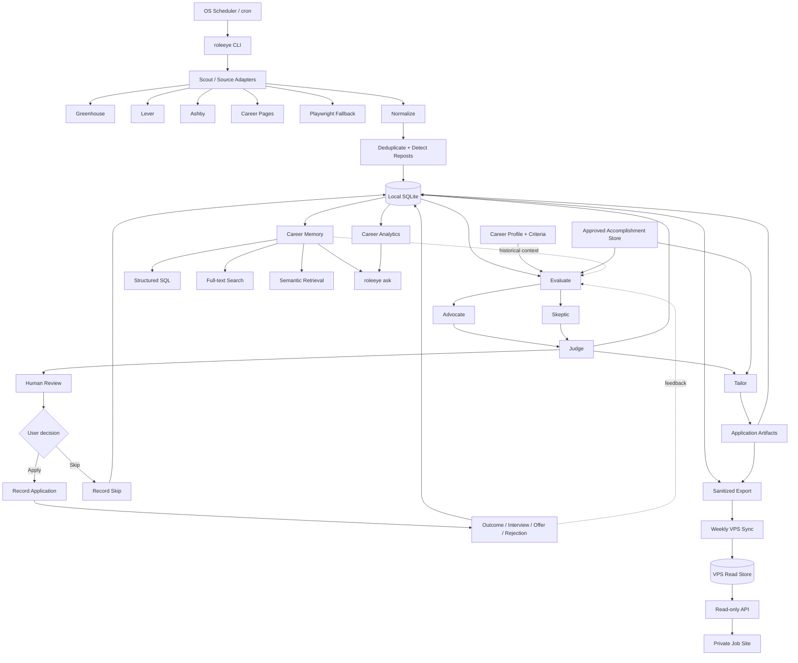
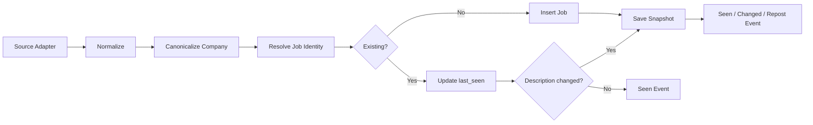
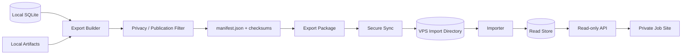
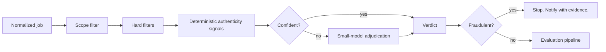
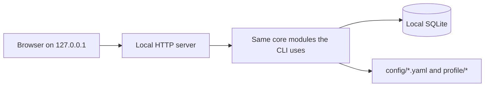

# RoleEye Architecture

> **RoleEye** — a local-first AI career agent that keeps an eye on the job market, while keeping the human in the loop.

## 1. Overview

RoleEye is a **local-first job discovery, career decision, application-memory, and analytics system**.

The architecture intentionally separates:

1. deterministic acquisition and persistence
2. LLM-based judgment
3. artifact generation
4. application history
5. structured + semantic retrieval
6. analytics
7. optional VPS replication / serving

The local SQLite database is the source of truth.

The system should begin as a CLI application and grow incrementally.

---

## 2. Architecture Goals

### Functional goals

- scan selected job sources daily
- normalize postings from different ATS providers
- retain every discovered posting
- detect duplicates and reposts
- score roles against configurable preferences
- explain fit and risks
- create tailored resume variants without inventing facts
- save application answers and artifacts
- track application status over time
- search historical jobs and applications
- provide local RAG after sufficient history exists
- calculate job-search funnel analytics
- export/sync sanitized datasets to a VPS
- expose a read-only API later for a private job-site dashboard

### Non-goals for v1

- auto-submitting applications
- browser-driving LinkedIn/Indeed as the primary discovery mechanism
- distributed microservices
- cloud-first storage
- multi-user SaaS
- automated recruiter outreach
- complex web UI
- autonomous edits to the user's master resume facts

---

## 3. High-Level System

RoleEye is organized around a continuous, human-approved learning loop:

```text
ROLEEYE

Scout → Evaluate → Human Review → Apply → Outcome
  ↑                                      │
  └──────────── Career Memory ───────────┘
```

The implementation underneath that product loop is:



---

# 4. Recommended Technology

## Runtime

- Node.js 22+
- TypeScript
- strict mode

## Local persistence

- SQLite
- migrations checked into the repository
- WAL mode when appropriate
- FTS5 for full-text search

## Configuration

- YAML for human-edited preferences/sources
- environment variables for secrets

## Validation

- Zod (or equivalent)

## HTTP

- native `fetch`
- provider-specific adapters

## HTML parsing

- lightweight DOM/parser library when required

## Browser fallback

- Playwright

Use browser automation only when deterministic HTTP/structured feeds are insufficient.

## CLI

Use a stable TypeScript CLI framework or a small explicit command router.

The CLI must support scripting and meaningful exit codes.

## LLM boundary

Create an interface rather than coupling core logic to one model/runtime.

Example:

```ts
interface ReasoningProvider {
  evaluateJob(input: JobEvaluationInput): Promise<JobEvaluationResult>;
  tailorResume(input: ResumeTailoringInput): Promise<ResumeTailoringResult>;
  answerCareerQuery(input: CareerQueryInput): Promise<CareerAnswer>;
}
```

Copilot CLI may be used during development and may optionally be used as one runtime provider through non-interactive invocation, but core storage, scanning, deduplication, and analytics must not depend on an interactive Copilot session.

---

# 5. Copilot CLI Integration

GitHub Copilot CLI should primarily serve two purposes:

## Development agent

Use Copilot CLI to implement the repository from `agent.md` + `architecture.md`.

## Optional reasoning runner

A provider may invoke Copilot CLI programmatically for bounded reasoning tasks.

Example conceptual boundary:

```text
roleeye evaluate <job-id>
        │
        ▼
create evaluation-input.json
        │
        ▼
CopilotReasoningProvider
        │
        ▼
copilot non-interactive prompt
        │
        ▼
validated evaluation-output.json
```

All returned output must pass schema validation before being persisted.

Do not depend on free-form prose when the caller expects structured data.

---

# 6. Scheduling

Long-running daily behavior should use the operating system scheduler.

Examples:

- cron on Linux/macOS
- Task Scheduler on Windows

Recommended daily job:

```text
roleeye scan
roleeye recommend --notify
```

Recommended weekly job:

```text
roleeye export --private
roleeye sync
```

Scheduling should call deterministic RoleEye commands.

The application should not require an interactive Copilot CLI session to stay open.

---

# 7. Repository Layout

```text
roleeye/
├─ agent.md
├─ architecture.md
├─ README.md
├─ package.json
├─ tsconfig.json
├─ .env.example
├─ .gitignore
│
├─ config/
│  ├─ criteria.example.yaml
│  ├─ sources.example.yaml
│  ├─ archetypes.example.yaml
│  └─ sync.example.yaml
│
├─ profile/
│  ├─ career-profile.example.md
│  ├─ accomplishments.example.yaml
│  └─ master-resume.example.md
│
├─ src/
│  ├─ index.ts
│  │
│  ├─ cli/
│  │  ├─ scan.ts
│  │  ├─ show.ts
│  │  ├─ evaluate.ts
│  │  ├─ recommend.ts
│  │  ├─ resume.ts
│  │  ├─ digest.ts
│  │  ├─ schedule.ts
│  │  ├─ ui.ts
│  │  ├─ stats.ts
│  │  ├─ doctor.ts
│  │  ├─ application.ts   (phase 5)
│  │  ├─ ask.ts           (phase 7)
│  │  └─ export.ts        (phase 6)
│  │
│  ├─ config/
│  ├─ db/
│  │  ├─ database.ts
│  │  ├─ migrations/
│  │  └─ repositories/
│  │
│  ├─ discovery/
│  │  ├─ source-adapter.ts
│  │  ├─ greenhouse.ts
│  │  ├─ lever.ts
│  │  ├─ ashby.ts
│  │  └─ generic-career-page.ts
│  │
│  ├─ normalize/
│  ├─ evaluate/
│  │  ├─ evaluator.ts
│  │  ├─ prompts.ts
│  │  ├─ schemas.ts
│  │  ├─ screen.ts
│  │  ├─ authenticity.ts
│  │  ├─ criteria.ts
│  │  ├─ budget.ts
│  │  ├─ priority.ts
│  │  ├─ hard-filters.ts
│  │  └─ scoring.ts
│  │
│  ├─ reasoning/
│  │  ├─ provider.ts
│  │  ├─ agent-cli.ts
│  │  ├─ openai-compatible.ts
│  │  ├─ scripted.ts
│  │  └─ registry.ts
│  │
│  ├─ resume/
│  │  ├─ documents.ts
│  │  ├─ extract.ts
│  │  ├─ import.ts
│  │  ├─ archetypes.ts
│  │  ├─ assign.ts
│  │  ├─ matcher.ts
│  │  ├─ tailor.ts
│  │  ├─ generator.ts
│  │  ├─ validate.ts
│  │  ├─ render.ts
│  │  ├─ diff.ts
│  │  └─ delta.ts
│  │
│  ├─ portal/
│  ├─ notify/
│  ├─ schedule/
│  ├─ core/
│  ├─ util/
│  ├─ applications/       (phase 5)
│  ├─ search/             (phase 6)
│  │  ├─ structured.ts
│  │  ├─ fulltext.ts
│  │  ├─ semantic.ts
│  │  ├─ planner.ts
│  │  └─ answer.ts
│  │
│  ├─ analytics/          (phase 6)
│  └─ export/             (phase 6)
│
├─ data/
│  └─ .gitkeep
│
├─ artifacts/
│  └─ .gitkeep
│
└─ tests/
   ├─ fixtures/
   ├─ unit/
   └─ integration/
```

---

# 8. Core Domain Model

## Job

Represents a logical opportunity.

Important fields:

```text
id
company_id
title
level
employment_type
work_arrangement
location_text
country
salary_min
salary_max
salary_currency
salary_period
source_type
source_job_id
source_url
canonical_url
description_text
description_hash
first_seen_at
last_seen_at
closed_at
created_at
updated_at
```

## JobSnapshot

Keep historical source snapshots.

```text
id
job_id
captured_at
source_url
raw_payload
raw_html_path
normalized_description
description_hash
```

Do not overwrite the only copy of a posting.

## JobSeenEvent

```text
id
job_id
seen_at
source_type
source_job_id
url
event_type  # discovered | seen_again | changed | reposted | closed
```

## Company

```text
id
name
normalized_name
domain
careers_url
notes
created_at
```

## Evaluation

Evaluations are versioned.

```text
id
job_id
profile_version
criteria_version
created_at

decision
score
confidence
headline

advocate_json
skeptic_json
judge_json

career_direction_fit
career_direction_reason
```

## Application

```text
id
job_id
created_at
applied_at
current_status
resume_artifact_id
application_url
referral
source
notes
```

## ApplicationStatusEvent

```text
id
application_id
from_status
to_status
occurred_at
notes
```

## Artifact

```text
id
job_id
application_id
type
path
checksum
created_at
metadata_json
```

Artifact types:

```text
resume
resume_diff
cover_letter
application_answers
interview_notes
recruiter_message
analysis
```

## Note

```text
id
job_id
application_id
company_id
created_at
kind
text
private
```

---

# 9. SQLite Schema Strategy

Use normalized relational tables for facts and JSON columns for provider-specific payloads / LLM structured details.

Recommended indexes:

- jobs(company_id, title)
- jobs(first_seen_at)
- jobs(last_seen_at)
- jobs(source_type, source_job_id)
- applications(applied_at)
- applications(current_status)
- evaluation(job_id, created_at)
- events(job_id, occurred_at)

Use unique constraints where identity is reliable.

Use migrations from the start.

---

# 10. Source Adapter Contract

```ts
interface JobSourceAdapter {
  readonly name: string;

  scan(config: SourceConfig): Promise<DiscoveredJob[]>;
}
```

A `DiscoveredJob` is raw-ish source data but must contain enough identity information to normalize.

```ts
type DiscoveredJob = {
  sourceType: string;
  sourceJobId?: string;
  companyName: string;
  title: string;
  location?: string;
  url: string;
  applyUrl?: string;
  description?: string;
  salary?: RawSalary;
  rawPayload?: unknown;
};
```

Adapters do not score jobs.

Adapters do not write directly to the database.

Adapters return data to the ingestion pipeline.

---

# 11. Ingestion Pipeline



All ingestion should be idempotent.

Running `roleeye scan` twice against the same source should not create duplicate logical jobs.

---

# 12. Deduplication and Repost Detection

## Identity hierarchy

Use in order:

1. stable source job ID
2. canonical apply URL
3. company + normalized title + location + strong description fingerprint
4. fuzzy candidate match requiring explicit confidence threshold

Never merge two jobs only because titles are similar.

## Repost

A repost is the same logical role appearing again after:

- source ID changes
- posting disappears and returns
- first/last seen gap exceeds configurable threshold
- content changes only modestly

Store a repost event rather than losing earlier timing.

---

# 13. Criteria Configuration

Example:

```yaml
profile_name: default

decision_thresholds:
  apply: 78
  maybe: 62

weights:
  career_direction: 20
  hands_on: 15
  product_customer: 15
  ai_relevance: 15
  technical_domain: 15
  location: 10
  compensation: 10

hard_filters:
  countries:
    - US

  relocation:
    reject_if_required: true

  minimum_base_salary:
    amount: 200000
    currency: USD

preferences:
  work_arrangement:
    preferred:
      - remote
      - seattle-hybrid

  application_system:
    deny:
      - workday

  direction:
    positive:
      - hands-on IC
      - technical lead
      - product architecture
      - AI engineering
      - agentic workflows
      - direct customer contact

    negative:
      - organization management
      - large people-management scope
      - pure infrastructure
      - pure platform operations
```

These are data, not hard-coded code branches.

---

# 14. Evaluation Pipeline

## Stage A: deterministic filters

Before calling an LLM:

- salary threshold
- country/payroll
- required relocation
- role type deny-list
- application-system deny-list if configured
- known duplicate application

Do not spend LLM calls on obvious rejects unless the user asks to review them.

## Stage B: requirement extraction

Create structured role features:

```json
{
  "primary_mission": "",
  "seniority": "",
  "management_scope": "",
  "hands_on_expectation": "",
  "customer_contact": "",
  "ai_role": "",
  "required_skills": [],
  "preferred_skills": [],
  "domain": [],
  "location": {},
  "compensation": {},
  "risks_to_verify": []
}
```

## Stage C: Advocate / Skeptic / Judge

Use separate prompts / sub-agents or separate reasoning calls.

Persist all three results.

This makes evaluations inspectable and helps later analytics.

---

# 15. Resume Fact Store

Facts are the factual boundary for resume generation: no generated claim exists
that does not trace to an approved fact.

## Ownership: SQLite holds facts, YAML imports and exports them

`profile/accomplishments.yaml` is a **seed and interchange format, not the store**.
The store is SQLite (§9: configuration is YAML, state is SQLite).

A fact carries lifecycle state — draft or approved, who approved it and when,
which document it was imported from, which generated bullets cite it. That is
state, and a file the user may hand-edit cannot hold it safely: editing the
statement of an approved fact in a text editor would silently re-approve text no
one reviewed.

Therefore:

- `roleeye resume import` reads `.docx`, `.pdf`, or `accomplishments.yaml` and
  writes **draft** facts. Import is explicit and repeatable; re-importing an
  unchanged statement is a no-op, and a changed statement returns the fact to
  draft.
- Approval happens in the database, per experience block (§33 Phase 3a notes:
  approving 60 atomic facts is a form nobody fills in honestly).
- `roleeye resume export-facts` writes the YAML back out, so the user keeps a
  readable, version-controllable copy and nothing is locked in.
- `profile/accomplishments.example.yaml` remains the authoring template.

The YAML shape below is therefore the import and export format.

Example:

```yaml
experiences:
  - id: starbucks-rewards
    company: Starbucks
    role: Senior Software Engineer / Technical Lead
    facts:
      - id: rewards-event-services
        statement: Designed event-driven microservices supporting Starbucks Rewards.
        tags:
          - loyalty
          - rewards
          - events
          - microservices

      - id: retail-scale
        statement: Worked on retail and rewards platforms supporting millions of daily transactions.
        tags:
          - retail
          - scale
```

Every generated resume bullet should carry internal provenance during generation:

```json
{
  "text": "Designed event-driven microservices supporting a large-scale rewards platform.",
  "source_fact_ids": ["rewards-event-services"]
}
```

The renderer may remove provenance from the final resume, but `resume-diff.md` should retain it.

---

# 16. Artifact Layout

Resumes are generated per **archetype** (§33 Phase 4), so they do not live under
a job directory. Per-application deltas do.

```text
artifacts/
  archetypes/
    <archetype-slug>/
      resume.md
      resume.docx
      resume-diff.md
      claims.json
  <company-slug>/
    <job-id>/
      evaluation.md
      evaluation.json
      resume-delta.md
      application-answers.md
      interview-notes.md
```

A per-job `resume.md` is written only when the user has produced a delta for
that posting; it is the archetype resume with the delta applied, never an
independent generation.

The database references artifact paths and checksums, and every generated
artifact records the inputs that produced it (§33 Phase 4).

---

# 17. Application Tracking

CLI examples:

```bash
roleeye apply-record JOB123 \
  --resume artifacts/zeta/JOB123/resume.md

roleeye status JOB123 recruiter-screen

roleeye status JOB123 interviewing \
  --note "Technical deep dive scheduled"

roleeye status JOB123 rejected \
  --note "Recruiter email"
```

Status history is append-only.

The current application row may cache the latest state, but history must be preserved.

---

# 18. Search Architecture

Search grows in three stages.

## Stage 1: SQL

Implement immediately.

Support:

- date range
- company
- role
- decision
- application status
- salary
- source
- location
- first/last seen

## Stage 2: SQLite FTS5

Index:

- title
- company name
- normalized job description
- evaluation headline
- evaluation reasons
- notes
- application answers

## Stage 3: Semantic embeddings

Do this only after useful history exists.

Create an `EmbeddingProvider` interface.

```ts
interface EmbeddingProvider {
  embed(texts: string[]): Promise<number[][]>;
}
```

Allow:

- local embedding model
- optional external provider
- no embedding mode

Do not make embeddings mandatory for basic operation.

---

# 19. RAG Document Model

Do not embed one giant application blob.

Create logical searchable documents.

Example document types:

```text
job-description
job-evaluation
application-answer
resume-strategy
interview-note
company-note
outcome-summary
```

Example:

```json
{
  "document_id": "eval_JOB123_2026-08-12",
  "entity_type": "job",
  "entity_id": "JOB123",
  "document_type": "job-evaluation",
  "created_at": "2026-08-12T20:00:00-07:00",
  "text": "...",
  "metadata": {
    "company": "Zeta Global",
    "title": "Senior Engineering Manager, Loyalty",
    "decision": "APPLY",
    "score": 88
  }
}
```

Chunk large descriptions by meaningful section.

Keep metadata with every chunk.

---

# 20. Query Planner

`roleeye ask` should classify questions into:

```text
STRUCTURED
KEYWORD
SEMANTIC
HYBRID
ANALYTICS
```

Examples:

### Structured

> When did I apply to Zeta?

SQL only.

### Analytics

> What percentage of Staff roles got recruiter screens?

Structured aggregation.

### Semantic

> Which roles felt most similar to the Zeta loyalty role?

Vector/semantic.

### Hybrid

> What AI IC roles did I see in July but skip?

SQL constraints:

- first_seen in July
- application does not exist / skipped

Semantic:

- AI IC intent

---

# 21. RAG Answer Contract

Every answer should include local evidence.

Example:

```text
You saw 6 roles matching this pattern.

1. Company A — Staff AI Engineer
   First seen: Jul 8
   Decision: SKIP
   Reason: infrastructure-heavy

2. Company B — Principal Agentic Engineer
   First seen: Jul 14
   Decision: APPLY
   Applied: Jul 15
```

Internally attach:

- job IDs
- evaluation IDs
- application IDs
- artifact paths

Never produce an exact date/status from semantic memory when a structured record exists.

---

# 22. Analytics Layer

Implement pure functions / SQL queries for metrics.

Core funnel:

```text
discovered
recommended
applied
recruiter_screen
interviewing
final
offer
```

Segment by:

- role family
- IC / EM / Director
- AI relevance
- industry/domain
- company stage if available
- remote/hybrid
- location
- salary band
- source
- resume strategy
- application month

Example output:

```json
{
  "period": "last_90_days",
  "applied": 31,
  "recruiter_screens": 7,
  "screen_rate": 0.226,
  "segments": {
    "principal_ic": {
      "applications": 12,
      "screens": 4,
      "screen_rate": 0.333
    }
  }
}
```

The LLM may explain these results but must not calculate them itself.

---

# 23. Learning Loop

Later, use outcomes as an additional recommendation signal.

Do not automatically rewrite the user's stated preferences.

Instead calculate:

```text
stated preference score
historical outcome score
```

Keep them separate.

Example:

```text
Role fit: 86/100
Historical response likelihood: strong relative to your recent applications

Why:
Roles with similar hands-on AI + product characteristics have produced
more recruiter screens than management-heavy Director roles.
```

This is decision support, not a guarantee.

---

# 24. Notification Layer

Define interface:

```ts
interface Notifier {
  send(message: NotificationMessage): Promise<void>;
}
```

Possible adapters later:

- terminal
- email
- desktop
- Telegram
- Slack
- ntfy-compatible endpoint

Start with terminal output + one simple notification mechanism.

Do not couple evaluation code to a notification provider.

---

# 25. VPS Export Architecture

The VPS should receive a sanitized derivative dataset.



---

# 26. Export Format

Recommended:

```text
export/<timestamp>/
├─ manifest.json
├─ jobs.jsonl
├─ evaluations.jsonl
├─ applications.jsonl
├─ application-events.jsonl
├─ companies.jsonl
├─ analytics.json
└─ search/
   └─ documents.jsonl
```

`manifest.json`:

```json
{
  "schema_version": 1,
  "generated_at": "2026-08-16T02:00:00-07:00",
  "mode": "private",
  "record_counts": {},
  "checksums": {}
}
```

Exports must be reproducible and versioned.

---

# 27. Public vs Private Export

## Private

May include:

- decisions
- application status
- personal notes
- interview notes
- full evaluation
- tailored resume metadata

Still exclude secrets.

## Public

Allow-list only.

Recommended public fields:

- company
- title
- location
- compensation if source provides it
- first seen
- last seen
- source URL
- source
- short agent-authored summary
- tags

Do not publish:

- private recruiter contact information
- personal email/phone/address
- application answers
- interview notes
- resume files
- referral details
- private status notes
- authentication data

---

# 28. VPS Read Model

Do not require the VPS to run the entire local agent.

The first VPS version should only:

1. import export package
2. populate read-only database/index
3. serve authenticated API
4. power private dashboard/search

Potential future endpoints:

```text
GET /api/jobs
GET /api/jobs/:id
GET /api/applications
GET /api/analytics
POST /api/search
```

If semantic search runs on VPS later, keep it as a separate optional component.

---

# 29. Security Model

## Local

- `.env` ignored
- database directory ignored unless deliberately backed up
- artifacts private by default
- secrets redacted from logs
- provider tokens never passed in prompts

## Copilot / LLM invocation

Pass only the minimum required context.

Avoid sending:

- phone numbers
- personal email addresses
- authentication tokens
- recruiter private email addresses
- unrelated interview notes

## VPS

- authenticated transport
- least-privilege deployment user
- read-only API access where possible
- private dashboard authentication
- firewall
- automatic security updates as appropriate
- regular backup of the VPS read store, while remembering local remains authoritative

---

# 30. Failure Handling

A daily scan should continue when one provider fails.

Example result:

```text
Greenhouse: 142 jobs fetched
Lever: 88 jobs fetched
Ashby: failed - HTTP 503
Career pages: 17 jobs fetched

Scan completed with warnings.
```

Persist source run history.

Recommended table:

```text
source_run
id
source_name
started_at
finished_at
status
records_seen
records_new
error
```

Do not mark previously known jobs closed after a single failed source run.

---

# 31. Observability

Local logs should include:

- scan ID
- source adapter
- number fetched
- number new
- number changed
- number deduped
- evaluation count
- LLM failures
- notification failures
- export/sync status

Keep logs readable and redact secrets.

`roleeye doctor` should validate:

- config
- database
- migrations
- source connectivity
- artifact path
- optional reasoning provider
- optional embedding provider
- VPS sync config

---

# 32. Testing Strategy

## Unit tests

- title normalization
- company normalization
- salary parsing
- URL canonicalization
- dedupe keys
- repost logic
- scoring
- hard filters
- state transitions
- export redaction
- claim provenance validation

## Fixture tests

Commit captured/sanitized fixtures for:

- Greenhouse
- Lever
- Ashby

Provider tests should not require internet access.

## Integration tests

Test:

```text
fixture → adapter → normalize → dedupe → database
```

Test a full role lifecycle:

```text
discover → evaluate → recommend → resume → apply → interview → reject
```

## RAG tests

Create a small deterministic test corpus and verify:

- SQL questions use SQL facts
- semantic similarity finds related roles
- hybrid date/status constraints are respected
- private data does not leak into public export

---

# 33. Implementation Phases

## Phase 0 — Bootstrap

Build:

- TypeScript project
- CLI skeleton
- config loader
- SQLite database
- migrations
- logging
- tests
- README

Acceptance:

```bash
roleeye --help
roleeye doctor
```

works.

---

## Phase 1 — Discovery + History

Build:

- source adapter interface
- Greenhouse adapter
- normalization
- dedupe
- snapshots
- first/last seen
- source run history
- `scan`
- `show`

Acceptance:

- repeated scans are idempotent
- descriptions are retained
- changed descriptions create snapshots
- all discovered jobs remain queryable

---

## Phase 2 — More Sources + Discovery Scope

Add:

- Lever
- Ashby
- generic career page support
- optional Playwright fallback
- discovery scope configuration (§36)
- capture modes: `full`, `history`, `scoped`
- `roleeye add <url>` for postings no adapter reaches
- `roleeye scope test`

Acceptance:

- source failure does not stop entire scan
- duplicates across sources are handled conservatively
- a 400-role board yields only in-scope roles for evaluation, while remaining
  fully queryable as market history
- changing scope never rewrites or deletes previously captured history

---

## Phase 3a — Deterministic Screening

No model is called in this phase. Everything here is free, fast, and testable,
and it is what makes the expensive phase affordable.

Build:

- criteria loader with a content-derived hash for cache keys
- deterministic hard filters (§14 stage A)
- deterministic authenticity screening (§37)
- spend accounting tables and budget configuration, ready for 3b
- `roleeye screen`, `roleeye verify`
- `roleeye backup`, taken automatically before every migration
- `roleeye schedule install|status|remove`
- interactive `roleeye init`

Acceptance:

- a role failing a hard filter is reported with the specific rule that rejected it
- missing data never silently rejects or silently admits; the behaviour is
  configured and reported
- fraud markers are detected on first sight
- longitudinal signals refuse to render a verdict until enough history exists
- a daily scan can be scheduled with one command on Windows and on cron systems

---

## Phase 3b — Evaluation

Build:

- requirement extraction
- ReasoningProvider boundary
- fit evaluation with an explicitly skeptical pass
- evaluation persistence bound to the snapshot judged
- evaluation cache keyed by content, profile, and criteria hashes
- per-call spend accounting against the budget
- `roleeye evaluate`, `roleeye recommend`, `roleeye stats --cost`

Acceptance:

```bash
roleeye recommend
```

returns concise APPLY/MAYBE/SKIP results.

- an unchanged posting is never evaluated twice
- a posting failing a deterministic filter never reaches a model
- every model call is recorded with stage, model, tokens, and estimated cost
- an exhausted budget stops the run cleanly and reports what remains queued
- a high fraud risk blocks evaluation and artifact generation

---

## Phase 3.5 — Notifications

Scheduling ships in 3a and configuration moved to its own phase, so the
unattended loop only needs a way to reach the user.

Build:

- `Notifier` interface with terminal, desktop, and webhook adapters
- daily digest generation

Acceptance:

- a scheduled scan can notify without a terminal attached
- every notification links to the underlying local record

---

## Phase 3c — Configuration Portal

Brought forward from 6.5 on user feedback: YAML is a good storage format and a
poor authoring format, and hand-writing it was blocking real use. Scoped to
configuration only — the review queue still waits until there is application
state to manage.

Build:

- `roleeye ui`: a localhost-only server over the existing modules
- forms for sources, scope, hard filters, and screening
- board lookup that verifies a pasted careers URL against the live adapter
- read-only scope preview, identical to `roleeye scope test`

Acceptance:

- the portal writes the same YAML the CLI reads, through the same schemas
- invalid input is rejected per field and nothing is written
- no business logic exists in the web layer
- the server binds to `127.0.0.1` only and refuses cross-origin writes
- posting-derived text renders as text, never as markup

---

## Phase 4 — Resume + Application Artifacts

Resumes are tailored per **role archetype**, not per posting. See `docs/vision.md`
§7: one generation per posting costs 100x more and produces documents the user
never reads, which is worse for them, not better.

### The archetype classifier has to be built

An earlier version of this phase said archetypes are "mapped from the existing
role-family classifier". **There is no such classifier.** `src/portal/presets.ts`
holds `ROLE_FAMILIES`, which compile a user's UI selections into *scope
configuration* — title terms deciding what to capture. They describe what the
user wants to see, not what a posting is. The same wrong claim appeared in
`docs/vision.md` and was corrected there on 2026-08-13; this is the same
correction applied to the plan.

The classifier is deterministic first, for the same reason screening is:

- each archetype declares title terms, core skills, and exclusions, seeded from
  `ROLE_FAMILIES` and editable in the portal
- a posting is scored against every archetype from its title and the
  requirements Phase 3b already extracted and stored — no new model call, no new
  spend, and no re-reading of the posting body
- a clear winner assigns; a tie or a weak best score leaves the posting
  `unassigned` and the user assigns it, which is also the signal that an
  archetype is missing
- a model is consulted only if the user opts in, only to choose between two
  named archetypes, and never to invent one

### Facts live in SQLite

See §15. `profile/accomplishments.yaml` is an import and export format; the
store is the database, because approval is lifecycle state and a hand-edited
file cannot hold it honestly.

### Storage (migration 005)

The `artifacts` table from migration 001 is **rebuilt, not reused**. It predates
migration 003 and carries the same defect that forced `evaluations` to be
corrected: it names a job and nothing else, so a generated document cannot be
attributed to the facts, archetype, profile, or posting content that produced
it, and cannot be marked stale when any of them changes. Pre-creating it in 001
was a mistake (see the decisions log, 2026-08-13).

Migration 005 adds:

- `experiences` — an employment block; the unit of approval
- `facts` — statement, tags, experience, status (`draft` / `approved`),
  approved_at, statement hash, and the import it came from
- `fact_imports` — one row per imported document: path, sha256, format, byte
  size, extractor and version, counts
- `archetype_assignments` — assignment carries the score, the method
  (`deterministic` / `manual` / `model`), and the archetype hash
- `resume_generations` and `resume_claims` — archetype, fact set hash, profile
  hash, provider, model, and every generated sentence with the facts it cites
- `artifacts` gains `archetype_id`, `snapshot_id`, `content_hash`,
  `generation_id`, and `superseded_at`

Archetypes themselves are **configuration**, not a table: `config/archetypes.yaml`
with a content-derived hash, exactly as criteria are. They are declarative, the
user owns them, and the portal edits them. Only the assignment is state.

### Document import dependencies

Import reads documents the user supplies. Three libraries were tested against
real files before being chosen:

| Need | Choice | Cost | Status |
|---|---|---|---|
| `.docx` read | `mammoth` | 2.1 MB | dependency |
| `.docx` write | `docx` | 4.4 MB | dependency |
| `.pdf` text | `pdfjs-dist` | 32.9 MB | **optional peer**, dynamically imported |

`pdfjs-dist` follows the Playwright precedent (§4): a large install most users
never need, loaded through a dynamic import, with an error that names the fix —
install it, or export the resume as `.docx`. `.docx` import is the primary path
and must not require a second install.

A resume is a file of unknown provenance — templates are downloaded, and a PDF
is a program format. Import therefore obeys §40 as posting text does: the file
size is bounded before parsing, extracted text is capped, the PDF reader runs
with `isEvalSupported: false` and no worker or network access, extracted text is
fenced as untrusted when it reaches a prompt, and no imported byte can name a
path, a command, or a fact ID.

Build:

- accomplishment fact store in SQLite, with YAML import and export
- `.docx` / `.pdf` resume import producing **draft, unapproved** facts
- explicit fact approval, per experience block
- role archetypes (3-6) and the deterministic classifier above
- one reviewed, tailored resume per archetype, regenerated when the archetype
  changes rather than when a posting arrives
- per-posting **delta** only, produced on `APPLY`: headline, bullet ordering,
  short cover note
- fact-to-requirement matching
- claim validation
- resume diff
- `.docx` rendering of the tailored resume

Acceptance:

- every changed factual claim maps to approved fact IDs
- no unsupported claim can pass validation
- an imported fact cannot be used until a human approves it
- evaluating N postings across M archetypes performs M resume generations, not N
- classification of N postings makes zero model calls by default
- a generated artifact records the facts, archetype, and profile hash that
  produced it, and is marked stale when any of them changes
- an import of a 50 MB or malformed file fails with a stated reason and writes
  nothing

---

## Phase 5 — Application Tracking + Notifications

Build:

- application entity
- state history
- notes
- notifier interface
- daily digest
- **application question bank** (`docs/vision.md` §8): stored answers reused
  across employers, split into
  - *recalled* answers, filled from settings the user already stated
  - *composed* drafts, generated from approved facts and clearly marked
  - *never invented* — protected categories stay empty and flagged when the
    user has not supplied an answer
- form inspection: read a posting's application form and report which questions
  it asks beyond the resume

Acceptance:

```bash
roleeye apply-record JOB123
roleeye status JOB123 interviewing
```

preserves full history.

- a protected-category question with no stored answer is reported as unanswered,
  never filled from a similar previous answer

---

## Phase 6 — Search + Analytics

Build:

- SQL search
- FTS5
- funnel analytics
- segment analytics
- `stats`
- basic `ask`

Acceptance:

- exact historical questions do not require embeddings
- funnel results are reproducible from database records

---

## Phase 6.5 — Review Portal

Extends the configuration portal from 3c once there is state worth managing.

Build:

- review queue with evaluation reasoning and authenticity signals
- job history and application timeline
- analytics and spend views

Acceptance:

- the portal writes the same YAML files the CLI reads, through the same schemas
- no business logic exists in the web layer
- the server binds to `127.0.0.1` only and refuses non-local origins
- posting text renders escaped; a posting containing markup or instructions
  cannot alter the page or the agent's behaviour

---

## Deferred — VPS Sync and Private Job Site

**Not planned work.** These were phases 8 and 9. They are demoted to optional
because RoleEye's goal is an agent anyone can run and schedule on their own
machine, and a single-user tool already has a local portal.

If remote access is wanted later, a tunnel to the local portal achieves it
without an export format, a sync protocol, or a second datastore. Revisit only
if a concrete need appears.

The privacy rules for export (§27) still apply if this is ever built.

---

## Phase 7 — Career Memory / Local RAG

Speculative. Build only if the tool is still in daily use and the database holds
enough history for semantic retrieval to beat structured search.

Build:

- searchable document generation
- embedding provider interface
- local vector index
- query planner
- hybrid retrieval
- evidence-backed answers

Acceptance:

```bash
roleeye ask "which agentic AI roles did I see last month but not apply to?"
```

combines structured constraints and semantic relevance correctly.

---

## Phase 8 — Learning Loop

Speculative, and dependent on feedback captured much earlier: application
overrides are recorded from Phase 5 onward precisely so this phase has data to
learn from.

Build:

- outcome correlation
- response rates by role profile
- response rates by resume strategy
- recommendation feedback signals

Acceptance:

- historical performance is displayed separately from stated preference score
- system never implies correlation proves causation

---

## Phase 9 — Desktop Application Shell

The app is a shell around the CLI, not a rewrite of it (`docs/vision.md` §3).
The shell loads the existing portal over `127.0.0.1` and runs the Node CLI as a
sidecar, so the no-bundler constraint holds and there is one UI implementation.

The shell is a Windows tray helper rendering in the user's own browser, not a
native window. Tauri, Wails and no-shell were prototyped against the real portal
and measured; `docs/desktop-shell-decision.md` records the numbers, names Tauri
as the fallback, and lists the conditions that would reverse the choice.

Build:

- tray helper pointing at the portal, with the CLI as a managed sidecar
- engine selection as a first-run step (agent CLI, local model, or API key)
- schedule management with a visible next-run time
- native toast notifications
- live run log: what was found, what was screened out and by which rule, what
  was evaluated and what it consumed
- assisted application: open the posting, present the archetype resume and the
  drafted answers, and stop. The human presses submit.

Acceptance:

- every action the app performs is available as a CLI command
- the app never submits an application
- a run is fully reconstructable from the local database after the app closes
- Phase 7 (local RAG) is optional at runtime, never a hard dependency

Open: nothing. The sidecar bundles its own Node runtime — measured at +20.9 MiB
of installer and +81.2 MiB installed, which also pins the `better-sqlite3`
native ABI to the runtime we ship (`docs/desktop-shell-decision.md` §3.4). The
scheduled task line must therefore resolve `nodePath` to the bundled
`node.exe`, not to whatever is on `PATH`.

---

## Phase 10 — Tool-Using Agent Mode (gated)

**Phase 10a (agent as reasoner) shipped with Phase 3b.** An agent CLI invoked
with `--deny-tool=all --disable-builtin-mcps --no-custom-instructions` has the
blast radius of an API call: it reads text and returns text. No approval bypass
is required, because a reasoner does not act.

What remains gated is the agent that *acts*:

- **10b — application assistant.** Narrow browser automation with typed
  capabilities (`readQuestion`, `setField`, `uploadApprovedArtifact`) and no
  general shell. A general-purpose coding agent must not be the security
  boundary for browser automation.

Do not build 10b before the controls in `docs/vision.md` §6.3 exist, and do not
treat that section as advisory. Job postings are attacker-controlled text, and
an approval-bypassed agent running as the user turns a prompt injection into
code execution with that user's privileges. Structured fields are *not* trusted
fields — titles, company names, model-extracted requirements, form questions and
the RAG index all carry attacker-chosen content.

Build, in this order:

- a dedicated agent workspace, with junction and symlink escapes blocked
- a sandbox (AppContainer/LPAC or disposable VM) rather than a second user
  account, which is often prohibited on managed devices and does not inherit the
  agent's authentication
- per-task approval, with approval bypass opt-in and described in plain language
- a recorded, visible transcript, treated as detective evidence and protected as
  PII
- workspace-scoped writes and refused egress, including DNS, git, browser
  navigation and the local RAG service

Acceptance:

- a posting containing embedded instructions cannot cause a filesystem write
  outside the agent workspace, demonstrated by an actual adversarial fixture
- approval bypass is never the shipped default
- disabling 10b returns the system to a fully functional reasoner-only tool

---

# 34. First Vertical Slice

The first implementation should be intentionally small:

```text
config
  ↓
Greenhouse adapter
  ↓
normalize
  ↓
dedupe
  ↓
SQLite
  ↓
roleeye scan
  ↓
roleeye show
```

Do not start with RAG.

Do not start with resume generation.

Do not start with a dashboard.

The historical dataset is the foundation.

---

# 35. Suggested First Copilot CLI Session

Prompt:

```text
Read agent.md and architecture.md completely.

We are building RoleEye from scratch.

Implement Phase 0 and Phase 1 only.

Use TypeScript and Node.js 22+. Build:
- repository structure
- strict TypeScript config
- configuration loading
- SQLite with migrations
- domain models
- source-run tracking
- JobSourceAdapter interface
- Greenhouse adapter
- normalization
- deterministic deduplication
- historical job snapshots
- first_seen / last_seen tracking
- roleeye scan
- roleeye show
- tests using saved fixtures
- README setup instructions

Keep the implementation local-first.
Do not implement LLM evaluation, RAG, resume generation, VPS sync, browser automation, or a web UI yet.

Before writing code, summarize your plan and list the dependencies you intend to add.
Then implement it, run the tests, and fix failures.
```

---

# 36. Copilot CLI Project Agent Option

The two design documents are intentionally normal Markdown files so they are useful independently of any specific agent runtime.

If desired, later create a Copilot CLI project custom-agent profile under:

```text
.github/agents/job-scout.agent.md
```

That custom agent can contain a short instruction telling it to read:

```text
agent.md
architecture.md
```

before implementing RoleEye tasks.

Keep the detailed architecture in these project documents rather than duplicating it into multiple agent profiles.

---

# 37. Final Architectural Rule

When choosing between:

```text
clever autonomous system
```

and:

```text
simple deterministic system + bounded LLM judgment
```

choose the second.

The durable value of RoleEye comes from:

- trustworthy history
- inspectable decisions
- fact-safe artifacts
- searchable memory
- measurable outcomes

not from maximizing autonomy.


---

# 36. Discovery Scope Configuration

A single ATS board commonly holds 50-400 postings. Measured across three real
public boards (227 postings), a typical description is ~1,500 tokens. Ingesting
and evaluating everything is both noisy and expensive, so scope is explicit
user configuration rather than an implicit "capture all" default.

## Capture modes

| Mode | Stores | Description body | Evaluates |
|---|---|---|---|
| `full` | every posting | yes | in-scope roles |
| `history` | every posting | metadata only | nothing |
| `scoped` | in-scope postings only | yes | in-scope roles |

`scoped` is the default. `history` exists because market history has value even
for roles the user will never apply to, and it costs almost nothing to keep.

## Configuration shape

```yaml
discovery:
  capture_mode: scoped

  scope:
    departments:
      include: [engineering, product]
      exclude: [sales, recruiting]

    titles:
      include: [engineer, architect]
      exclude: [intern, manager, director]
      patterns: ["(staff|principal|senior).*engineer"]

    levels:
      include: [senior, staff, senior-staff, principal]
      exclude: [intern, junior, director, vp]

    locations:
      countries: [US]
      remote_only: false
      metros: [seattle, "san francisco", "new york"]

    posted_within_days: 45
    max_new_per_source_per_scan: 50

sources:
  - name: bigcorp
    type: greenhouse
    board: bigcorp
    company: BigCorp
    capture_mode: history      # per-source override
    scope:
      titles:
        include: [platform]    # merges over the global scope
```

## Rules

- Scope filtering is deterministic and runs before hard filters and before any
  model call.
- Scope changes must never delete or rewrite previously captured history. A role
  that leaves scope stops being evaluated; it does not stop existing.
- `roleeye scope test` previews what the current configuration keeps and drops,
  against real stored data, without writing anything.
- `max_new_per_source_per_scan` is a safety valve against a board that suddenly
  publishes hundreds of roles; exceeding it warns rather than failing.

---

# 37. Job Authenticity Screening

A posting can be real, stale, an evergreen "ghost" listing, or an outright scam.
Screening runs after hard filters and before requirement extraction, so a
worthless posting never reaches an expensive model.



## Signal sources

The longitudinal database is the differentiating input here: repost cadence and
posting longevity are only visible to a system that never deletes history.

| Family | Example signals | Data source |
|---|---|---|
| Longevity | open beyond threshold; repeated reposts with unchanged content; rotating source IDs | `job_seen_events`, `job_snapshots` |
| Quality | description below minimum length; missing salary in a pay-transparency jurisdiction; boilerplate-only body | normalized job |
| Duplication | identical description across unrelated companies; one title posted across many locations at once | `fingerprint` index |
| Fraud | free-email or messaging-app contact; apply host unrelated to company domain; requests for payment, ID, or bank details | description scan |
| Provenance | no known company domain or careers page; unnamed-client agency listing | `companies` |

## Persistence

```text
job_authenticity
id
job_id
evaluated_at
verdict            # genuine | stale | ghost | fraudulent
confidence
signals_json       # every signal that fired, with its evidence
method             # deterministic | model-assisted
model              # null when deterministic
```

Verdicts are versioned like evaluations, never overwritten, so screening
accuracy can later be measured against real outcomes.

## Rules

- Signals are always shown; a verdict is never an unexplained label.
- `stale` and `ghost` reduce priority only. Nothing is hidden or deleted.
- `fraudulent` halts the pipeline: no evaluation, no resume, no artifacts.
- Screening is configurable and can be disabled entirely.
- The system never contacts a suspected fraudulent poster.

---

# 38. Token and Cost Model

## Measured inputs

From 227 real postings across three public Greenhouse boards
(`scripts/measure-corpus.ts` reproduces this):

| Metric | Value |
|---|---|
| Median description | 1,532 tokens |
| Mean description | 1,520 tokens |
| p90 description | 1,883 tokens |
| p99 description | 2,145 tokens |
| Estimated boilerplate share | ~44% |

## The cost of doing it naively

Thirty boards averaging 80 postings is ~2,400 postings. A four-call evaluation
(extract, advocate, skeptic, judge) carrying profile plus full description costs
roughly 10,800 input and 1,500 output tokens per role — about 26M input tokens
for a first full pass, repeated every scan if nothing is cached.

## The pipeline that avoids it

| Stage | Cost | Effect on the corpus |
|---|---|---|
| Discovery scope | free | 2,400 → ~200 |
| Hard filters | free | ~200 → ~120 |
| Authenticity signals | free | removes ghosts and scams |
| Cache by `description_hash` + profile/criteria version | free | steady-state scans approach zero |
| Boilerplate stripping | free | ~1,500 → ~850 tokens per description |
| Triage on a small model | cheap | ~120 → ~25 |
| Advocate / Skeptic / Judge | expensive | ~25 roles |

Two orders of magnitude separate these paths. The savings come from filtering
and caching, not from degrading the analysis of roles that matter.

## Accounting

```text
llm_calls
id
job_id
evaluation_id
stage              # triage | authenticity | extract | advocate | skeptic | judge | resume | ask
provider
model
input_tokens
output_tokens
estimated_cost_usd
request_count      # for per-request billing such as Copilot CLI
cache_hit
created_at
```

Pricing lives in configuration, never in code:

```yaml
budget:
  max_jobs_per_scan: 40
  max_cost_per_scan_usd: 1.00
  max_cost_per_month_usd: 20.00
  on_exhausted: stop        # stop | warn

models:
  triage:    { provider: openai, model: gpt-5-mini,  input_per_mtok: 0.25, output_per_mtok: 2.00 }
  reasoning: { provider: openai, model: gpt-5,       input_per_mtok: 1.25, output_per_mtok: 10.00 }
```

Providers billed per request rather than per token record `request_count` and
leave cost null. `roleeye stats --cost` reports spend by day, stage, and model.

## Rules

- A budget is a hard stop, not a warning. Remaining work stays queued.
- No stage may silently escalate to a more expensive model.
- Cache keys include the profile and criteria versions, so changing preferences
  correctly invalidates prior evaluations.

---

# 39. Local Portal

The CLI remains the engine. The portal is a local client over the same modules.



## Scope

- edit configuration and preferences through validated forms, writing the same
  YAML the CLI reads
- review queue: recommendations with Advocate / Skeptic / Judge reasoning,
  authenticity signals, and Apply / Skip decisions
- history: every job ever seen, with reposts, snapshots, and application timeline
- reports: funnel analytics, outcomes, and model spend
- notification inbox and schedule management
- fact approval for imported resume facts

## Constraints

- Binds to `127.0.0.1` only. Never `0.0.0.0`.
- No business logic in the web layer. It calls the same functions the CLI calls.
- All posting-derived text is escaped on output. Postings are hostile input.
- State-changing endpoints require a token minted at server start and verify the
  request origin, so a page in another tab cannot drive the agent.
- The portal is optional. Every action it offers exists as a CLI command.

---

# 40. Untrusted Content Handling

Job descriptions are attacker-influenced input. They flow into the database,
into prompts, into artifacts, and into the portal.

| Boundary | Requirement |
|---|---|
| Parsing | bounded response sizes; bounded description length; no unbounded backtracking in parsing regexes |
| Document import | bounded file size *and* bounded declared uncompressed size, both checked before anything is inflated; capped extracted text; PDF read with no eval, worker, or network access |
| Storage | stored as text, never executed or interpolated into SQL |
| Prompting | delimited and labeled as untrusted data, with a marker the author cannot predict; instructions inside a posting are reported, never obeyed |
| Model output | schema-validated before persistence; never trusted to name a file path or command; never trusted to carry a link, and every factual claim checked against approved facts |
| UI | escaped on output; links rendered with the destination host visible |
| Generated documents | posting-derived text is escaped before it is written into Markdown, so opening an artifact cannot fetch anything the poster chose |
| Export | sanitized through the allow-list, never republished verbatim in public mode |

A posting must never be able to cause a file write, a network request, a
configuration change, or an application submission.

## Why the fence marker is unguessable

Neutralising the literal marker inside the body was necessary and not
sufficient. `UNTRUSTED_JOB_P\u00adOSTING>>>` — one soft hyphen inside the word —
survives ingest and reaches the prompt intact, and a model reads it as the
marker. Word joiners, combining marks and Cyrillic homoglyphs do the same, and
enumerating them is a losing game against an attacker who picks next.

Each prompt therefore closes with `UNTRUSTED_JOB_POSTING_<random>`. Whoever
wrote the posting cannot know the suffix, so the class of attack ends rather
than the instances that were thought of. The literal label is still scrubbed
from the body.
